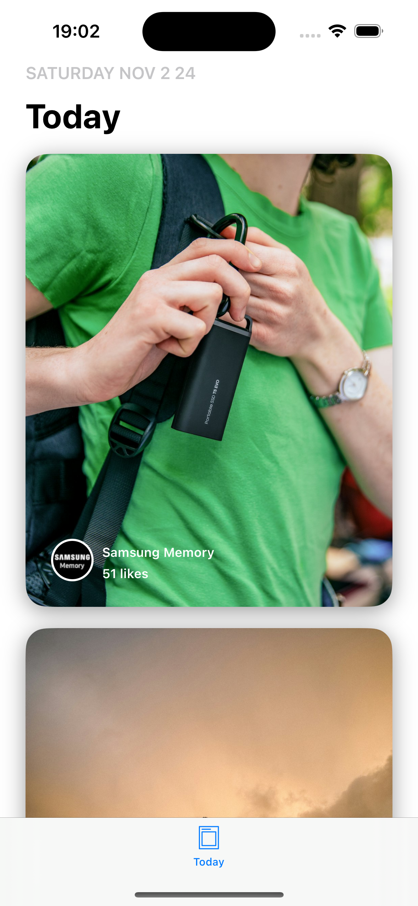

# Picture
### Project Overview

    
    &nbsp;&nbsp;&nbsp;
    
    &nbsp;&nbsp;&nbsp;
    

This iOS application consists of two main screens: Today and Detail. The app retrieves photos from an API and presents them in an Apple Store inspired design. Users can tap on a photo to view more details in a custom transition to the Detail screen.

### Screens
**Today Screen**
Functionality: The Today screen retrieves the first page of photos (10 items) from the /photos endpoint and displays them in a layout inspired by the Apple Store.

**Detail Screen**
Functionality: When a user taps on a photo in the Today screen, the app transitions to the Detail screen via a custom animation (based on a reference video provided).
Data: The Detail screen fetches additional photos by the same user from `/users/:username/photos` and gathers statistics about the selected photo from `/photos/:id/statistics`.

### Requirements

- Xcode: 15+
- iOS: 13.0+
- API: https://unsplash.com
- API Endpoints:
`/photos` – retrieves the initial set of photos for the TODAY screen.
`/users/:username/photos` – retrieves additional photos by the same user for the DETAIL screen.
`/photos/:id/statistics` – retrieves statistics about the tapped photo.

### Architecture

The app is structured following **Clean Architecture** principles, with separation into distinct layers to promote modularity and maintainability:

- **Data**: This layer handles all data-related operations, including data sources, networking, and data persistence.
- **Domain**: This layer contains the core business logic of the app, such as use cases and business rules, ensuring that the logic is independent of both data and presentation layers.
- **Presentation**: This layer manages the user interface and interaction, following the MVVM-C (Model-View-ViewModel-Coordinator) pattern to facilitate navigation and manage view presentation flow.

The app implements the **State pattern** in conjunction using **Combine**. This design pattern provides a structured way to manage state-specific behavior, enabling the application to transition between different UI states effectively.

Utilizing the **State pattern** allows for clear management of various UI states, ensuring that the interface is responsive and maintainable. This approach facilitates automatic updates to the UI based on changes in state, resulting in a more coherent user experience.

Additionally, the integration of the **State pattern** with **Combine** supports a smooth transition to **SwiftUI**. Both the **State pattern** and the reactive nature of **Combine** align with SwiftUI's declarative programming style, allowing for a more efficient presentation layer and simplifying the implementation of dynamic interfaces.

### Testing

Some tests have been implemented, focusing on the **ViewModels** and the transformation of **DTOs** into **Entities**, which are key parts of the app. These tests help ensure that the core functionality works as expected and that the data is processed correctly.

However, adding tests for the API layer would be beneficial. Testing the API interactions would help catch any issues with network responses and errors, making the app more reliable in the long run.

### Known Issues

- [ ] Some images are appearing in the wrong cells, likely due to issues with asynchronous loading and challenges related to reusability.
- [ ] At the end of the animation, the image format is "recalculated," causing a glitch. This issue is likely due to a mismatch between the original image format and the destination format.

### Future Improvements

- Handling errors
- Implement pull-to-refresh on the Today screen
- Add infinite scrolling or pagination for users with large photo collections
- Improve UI of Detail screen

